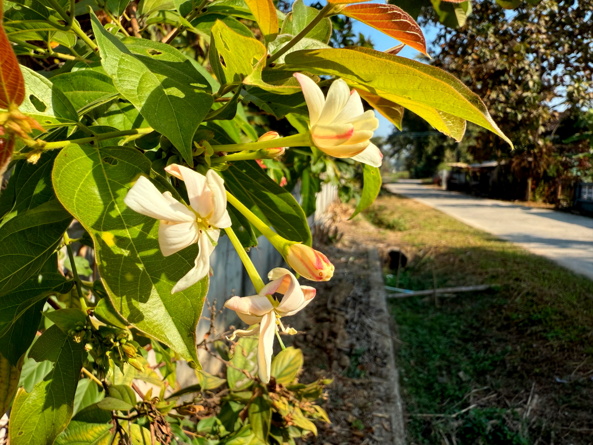
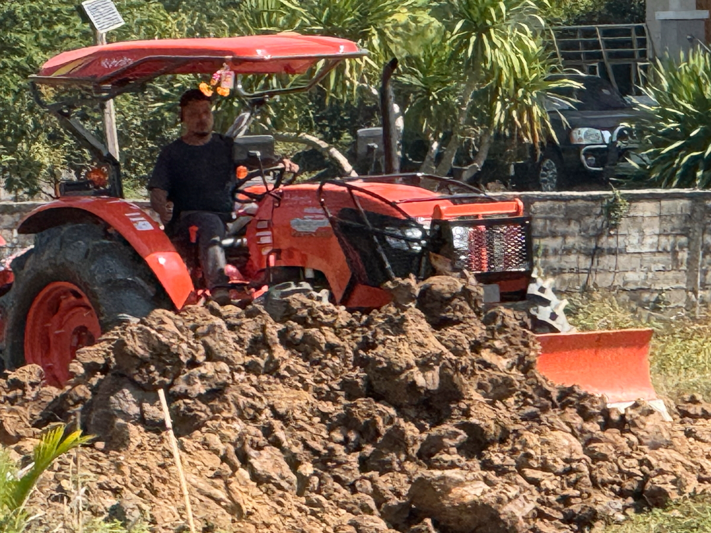

# 20250131_chiangrai

<html>
<head>

<meta charset="UTF-8">
<meta http-equiv="Content-Type" content="text/html; charset=UTF-8">
<meta http-equiv="X-UA-Compatible" content="IE=EmulateIE10" />
<meta http-equiv="X-UA-Compatible" content="IE=edge">

<!--ここから上はお決まりの定型文です-->

<!--ここからが表現の書式などを決めるcssという部分-->

<link href="https://cdnjs.cloudflare.com/ajax/libs/lightbox2/2.7.1/css/lightbox.css" rel="stylesheet">

</head>

<body>

モバイル端末をお使いの場合は、画面を横向きにすると
より見やすくご覧頂けます。

<!--ここ上は、ほぼそのまま使います！-->

<!--QRコードの挿入例-->

 アクセス用QRコード

<marquee direction="left" scrollamount="20" width="30%">(^_^)/~alis</marquee>

<!--流れ文字の挿入例-->
<h1><marquee behavior="left">!!! 2025/01/31、親戚にお昼をご馳走になり、日が暮れると細い月が綺麗!!!</marquee></h1>

                          

<!--ここから下が、本体部分-->

<h2>1日のスタートは綺麗な朝焼け</h2>

    
<h2>遺品整理したらもう一台、大画面PCが出てきて、YouTube再生マシンとして復活 テーブルの上は３画面状態に</h2>

    
<h2>最後に生まれたアヒルはよちよち歩きなので、しばし保護</h2>

    
<h2>食欲は旺盛なのでそのうち元気に歩くようになるでしょう</h2>
    
<iframe width="560" height="315" src="https://www.youtube.com/embed/qbiksiGviLY?si=YbLI6lc-PIFBfAIF" title="YouTube video player" frameborder="0" allow="accelerometer; autoplay; clipboard-write; encrypted-media; gyroscope; picture-in-picture; web-share" referrerpolicy="strict-origin-when-cross-origin" allowfullscreen></iframe>     
    
<h2>家の外、道路側のお花が綺麗に咲いたので撮りました</h2>

    
<h2>先週買った物干しキャリアの出番が来ました</h2>

    
<h2>お昼はいつもの親戚にご馳走になります</h2>

<h2>ここに集まった女性陣全員の共通の祖母姉妹</h2>

    
<h2>家の裏では青空の下、土地への土盛りが展開中</h2>

<h2>この空の広さは羨ましいですね〜</h2>

    
<h2>足元にはいつもの黄色いお花</h2>

    
<h2>賃金の手渡しもいつも通り</h2>

    
<h2>写真撮ってたらお話しできたお隣のお爺さん 笑うと前歯がないのは先日のお爺さんと同じ</h2>

    
<h2>休耕田を横切るトラックをバックに一枚パチリ！</h2>

    
<h2>廃車後も役立つトラックの荷台</h2>

    
<h2>猫の声が聞こえるな〜と思ったら屋根の上でした</h2>

    
<h2>この季節でも陽射しはきついのでパラソルは必須</h2>

    
<h2>重機の運転も汗だく</h2>

    
<h2>奥にお寺がある小径の入り口はこんなに立派に</h2>

    
<h2>何気ない植え込みの上に黄色いお花が一輪</h2>

    
<h2>屋根の上から、今度は鳩の鳴き声</h2>

    
<h2>仏壇の上のお花は、今日も満開</h2>

    
<h2>ニワトリの一家がお出迎え、餌のおねだりか？</h2>

    
<h2>夕方は庭の水やりと虹作り</h2>

    
<h2>夕暮れに細い月、画面中央付近です</h2>

    
<h2>暗くなると宵の明星「金星」とのコラボに</h2>

    
<h2>最後は綺麗な地球照を見せてくれました</h2>

<h2>今日のBGMは久々の洋楽で</h2>
<iframe width="560" height="315" src="https://www.youtube.com/embed/L9FKGuN1yBI?si=6Oo7vAC9VjZXc_CM" title="YouTube video player" frameborder="0" allow="accelerometer; autoplay; clipboard-write; encrypted-media; gyroscope; picture-in-picture; web-share" referrerpolicy="strict-origin-when-cross-origin" allowfullscreen></iframe> 

   
<h2>以上、親戚宅でお昼をご馳走になって平凡な一日 夕暮れ時には予期せぬ細い月が綺麗でした ここまで観ていただきありがとうございました。</h2>

     
<h2>
<a href="https://torokoid.github.io/20241126_chiangrai/" target="_blank">Back to the menu page</a>
</h2>

   

         

  

      

<!--本体はここまで-->

<!--画面に空白地帯を作って、背景が見えるようにしています-->
                                              

<!-- フッタ -->
<footer>

Copyright 2025/02/01 alis @ChiangRai

</footer>

<!--HPにさまざまなJavaScriptを呼び込むための書式-->

